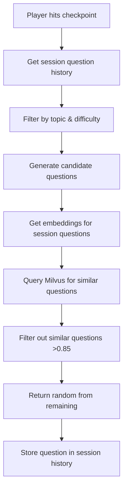

# Implementation Plan – **"Code Racer"** (Updated)

A Vite + React 2‑D racing game that teaches Software Engineering skills from beginner to Principal level.

---

## 1. Vision & Learning Objectives

| Objective | How It Appears In‑Game |
|-----------|------------------------|
| Introduce CS fundamentals | Early levels ask timed multiple‑choice on variables, control flow |
| Reinforce clean code & design patterns | Mid‑game challenges on SOLID, refactoring mini‑puzzles |
| Teach scalable architecture & DevOps | Late‑game boss levels require answering CI/CD, cloud, microservices questions |
| Foster continuous learning | Adaptive question bank, weekly "tournament" tracks new topics |
| **Semantic Question Diversity** | **Milvus vector DB ensures no semantically similar questions in same session** |

Success is measured by **player mastery progression** and **engagement metrics** (DAU, completion rate).

---

## 2. Target Audience & Difficulty Scaling

- **Personas**: Graduate, Junior Dev, Senior Dev, Principal/Architect.
- Dynamic difficulty algorithm ("rubber‑band AI") adjusts car speed and question complexity.
- Bloom's taxonomy mapping ensures growth from recall → synthesis/creation.
- **Semantic filtering** prevents repetitive question patterns within sessions.

---

## 3. Core Game Loop

1. **Matchmaking / Solo Start**  
2. **Race Segment** (real‑time car control)  
3. **Checkpoint Quiz** (timed Q&A; pause car)  
   - **All questions are multiple choice with exactly 3 options**
   - **Milvus vector search ensures semantic diversity**
4. **Outcome**  
   - Correct → boost + continue  
   - Incorrect → lose a "life"; on 3rd failure switch to **Spectator Mode**  
5. **Finish Line** → record time & score to leaderboard.

Engagement hooks: combo streaks, power‑ups unlocked by perfect answers, daily challenges.

---

## 4. Technology Stack

### 4.1 Front‑End
- **Vite 5** + **React 19** + **TypeScript**
- **PixiJS 8** (GPU‑accelerated 2‑D renderer) with custom ECS or use **Phaser 4** if physics needed.
- TanStack **React‑Query** for data‑sync; **Zustand** for local state.
- **Vitest** + **Testing‑Library** + **Playwright**.
- **Custom Ports**: Frontend runs on `http://localhost:3000`

### 4.2 Back‑End
- **.NET 9** minimal APIs + **ASP.NET Core Identity** delegated to **Duende BFF (OpenID Connect)**.
- **Entity Framework Core 9** (SQLite for development, PostgreSQL for production).
- **SignalR** (WebSockets) for real‑time race telemetry, lobby, leaderboard pushes.
- **Custom Ports**: Backend runs on `https://localhost:8443` and `http://localhost:8080`

### 4.3 Database
- **Primary DB**: **SQLite** (development) / **PostgreSQL 16** (production) with:
  - Schema‑per‑service (auth, game, analytics)  
  - **TimescaleDB** extension for high‑cardinality telemetry.
- **Vector DB**: **Milvus 2.4** for semantic question similarity:
  - Question embeddings via **OpenAI text-embedding-3-small**
  - Cosine similarity threshold: 0.85 (prevents similar questions)
  - Real-time semantic filtering during question selection

### 4.4 Dev & Ops
- **Docker / Docker Compose** for local dev parity.
- IaC: **Terraform 1.9** (modular) targeting Azure → AKS; alt cloud templates provided.
- CI/CD: **GitHub Actions** → build matrix (front‑end / API / migrations / e2e).
- Observability: **OpenTelemetry** + **Grafana Cloud** (Tempo, Loki, Prometheus).
- Feature flags: **LaunchDarkly** or OSS **Flagsmith**.

---

## 5. High‑Level Architecture

```
[Browser:3000] –HTTPS/WebSocket→ [API Gateway:8443] –gRPC→ [Game Service (.NET 9)]
                                      ↘︎ REST/GraphQL ↙︎                ↘︎ SignalR ↙︎
                            [Auth Service]            [Leaderboard Service]
                                             ↘︎            ↙︎
                                          [PostgreSQL]
                                             ↗︎
                                        [Milvus Vector DB]
                                      (Question Embeddings)
```

- BFF pattern: back‑end hosts OpenID interaction; front‑end stores secure HttpOnly tokens.
- CQRS segregation: queries (read) via Dapper; commands via EF Core & transactional outbox.
- **Semantic Layer**: Milvus provides vector similarity search for question diversity.

---

## 6. Question Format Standardization

### 6.1 Multiple Choice Format
- **All questions must have exactly 3 options (A, B, C)**
- **One correct answer, two plausible distractors**
- **Maximum question length**: 200 characters
- **Maximum option length**: 80 characters each

### 6.2 Semantic Diversity Engine
```yaml
# Question Selection Algorithm
1. Player requests question (topic, difficulty)
2. Get session history (last 10 questions)
3. Generate embeddings for potential questions
4. Query Milvus for semantic similarity
5. Filter out questions with >0.85 cosine similarity
6. Return random question from filtered set
```

### 6.3 Question Database Schema
```sql
Questions:
  - QuestionId (Primary Key)
  - Topic (JavaScript, C#, SOLID, etc.)
  - Difficulty (1-10)
  - BodyMarkup (Question text, max 200 chars)
  - OptionA (First choice, max 80 chars)
  - OptionB (Second choice, max 80 chars) 
  - OptionC (Third choice, max 80 chars)
  - CorrectOption (A, B, or C)
  - EmbeddingVector (1536-dimensional vector)
  - CreatedUtc
```

---

## 7. Milvus Integration

### 7.1 Vector Collection Schema
```python
collection_schema = {
    "name": "question_embeddings",
    "fields": [
        {"name": "question_id", "type": "INT64", "primary": True},
        {"name": "topic", "type": "VARCHAR", "max_length": 50},
        {"name": "difficulty", "type": "INT64"},
        {"name": "embedding", "type": "FLOAT_VECTOR", "dim": 1536},
        {"name": "created_at", "type": "INT64"}
    ]
}
```

### 7.2 Embedding Generation
- **Model**: OpenAI `text-embedding-3-small` (1536 dimensions)
- **Input**: Question text + all options concatenated
- **Batch Processing**: Generate embeddings for all questions on startup
- **Real-time**: Generate embedding for new questions on creation

### 7.3 Similarity Search
```csharp
// Semantic Question Filtering
public async Task<List<Question>> GetSemanticallySimilarQuestions(
    List<int> sessionQuestionIds, 
    string topic, 
    int difficulty)
{
    // Get embeddings for session questions
    var sessionEmbeddings = await GetQuestionEmbeddings(sessionQuestionIds);
    
    // Search Milvus for similar questions
    var similarQuestions = await milvusClient.SearchAsync(
        collectionName: "question_embeddings",
        vectors: sessionEmbeddings,
        topK: 100,
        searchParams: new { "metric_type": "COSINE", "params": { "nprobe": 16 } }
    );
    
    // Filter by similarity threshold (0.85)
    return similarQuestions.Where(q => q.Distance < 0.85).ToList();
}
```

---

## 8. Updated Ports Configuration

### 8.1 Development Ports
- **Frontend (Vite)**: `http://localhost:3000`
- **Backend HTTPS**: `https://localhost:8443`
- **Backend HTTP**: `http://localhost:8080`
- **SignalR Hub**: `https://localhost:8443/raceHub`
- **PostgreSQL**: `localhost:5432`
- **Milvus**: `localhost:19530`
- **Milvus Admin**: `http://localhost:9001` (Attu UI)

### 8.2 Docker Compose Services
```yaml
services:
  frontend:
    ports: ["3000:3000"]
  backend:
    ports: ["8080:8080", "8443:8443"]
  postgres:
    ports: ["5432:5432"]
  milvus:
    ports: ["19530:19530"]
  attu:
    ports: ["9001:3000"]
```

---

## 9. API Contract Updates

### 9.1 Question Endpoints
| Verb | Path | Purpose | Response |
|------|------|---------|----------|
| GET | /v1/questions/random | Get semantically diverse question | Question with 3 options |
| POST | /v1/questions | Create new question with embedding | 201 Created |
| GET | /v1/questions/similar/{id} | Get semantically similar questions | List of questions |

### 9.2 Question Response Format
```json
{
  "questionId": 123,
  "topic": "JavaScript",
  "difficulty": 3,
  "bodyMarkup": "What is the output of console.log(typeof null)?",
  "options": {
    "A": "object",
    "B": "null", 
    "C": "undefined"
  },
  "correctOption": "A",
  "timeLimit": 10
}
```

---

## 10. Updated Data Model

### 10.1 Question Entity (Updated)
```csharp
public class Question
{
    public int QuestionId { get; set; }
    public string Topic { get; set; }
    public int Difficulty { get; set; }
    public string BodyMarkup { get; set; }
    public string OptionA { get; set; }
    public string OptionB { get; set; }
    public string OptionC { get; set; }
    public char CorrectOption { get; set; } // 'A', 'B', or 'C'
    public float[] EmbeddingVector { get; set; } // 1536 dimensions
    public DateTime CreatedUtc { get; set; }
}
```

### 10.2 Session Question Tracking
```csharp
public class SessionQuestion
{
    public int Id { get; set; }
    public int SessionId { get; set; }
    public int QuestionId { get; set; }
    public int OrderIndex { get; set; }
    public DateTime AskedAt { get; set; }
    
    // Navigation
    public RaceSession Session { get; set; }
    public Question Question { get; set; }
}
```

---

## 11. Semantic Question Selection Algorithm

### 11.1 Selection Process


### 11.2 Embedding Pipeline
```csharp
public async Task<float[]> GenerateQuestionEmbedding(Question question)
{
    var input = $"{question.BodyMarkup} {question.OptionA} {question.OptionB} {question.OptionC}";
    
    var response = await openAiClient.GetEmbeddingsAsync(
        model: "text-embedding-3-small",
        input: input
    );
    
    return response.Data[0].Embedding.ToArray();
}
```

---

## 12. Performance Optimizations

### 12.1 Embedding Caching
- **Redis Cache**: Store frequently accessed embeddings
- **Batch Generation**: Process embeddings in batches of 100
- **Lazy Loading**: Generate embeddings on-demand for new questions

### 12.2 Milvus Optimization
- **Index Type**: IVF_FLAT for development, IVF_SQ8 for production
- **Search Parameters**: nprobe=16 for balance of speed/accuracy
- **Collection Partitioning**: Partition by topic for faster searches

---

## 13. Updated Docker Configuration

### 13.1 docker-compose.yml
```yaml
version: '3.8'
services:
  milvus:
    image: milvusdb/milvus:v2.4.0
    command: ["milvus", "run", "standalone"]
    ports:
      - "19530:19530"
    environment:
      ETCD_ENDPOINTS: etcd:2379
      MINIO_ADDRESS: minio:9000
    depends_on:
      - etcd
      - minio

  attu:
    image: zilliz/attu:latest
    ports:
      - "9001:3000"
    environment:
      MILVUS_URL: milvus:19530
```

---

## 14. Development Workflow

### 14.1 Question Creation Process
1. **Author Question**: Create question with 3 options
2. **Validate Format**: Ensure character limits and format
3. **Generate Embedding**: Create vector representation
4. **Store in Milvus**: Index for similarity search
5. **Store in Database**: Save relational data

### 14.2 Quality Assurance
- **Semantic Similarity Tests**: Verify no duplicate concepts
- **Difficulty Calibration**: A/B test question difficulty
- **Option Plausibility**: Ensure distractors are reasonable

---

## 15. Updated Success Metrics

- **Engagement**: 30‑day retention > 25 %
- **Learning**: avg score improvement 20 % after 10 sessions
- **Performance**: P99 API <150 ms
- **Question Diversity**: <5% semantic similarity in sessions
- **Embedding Quality**: >90% accuracy in similarity detection

---

**Key Updates:**
- ✅ **Custom Ports**: Frontend 3000, Backend 8080/8443
- ✅ **Milvus Integration**: Semantic question filtering
- ✅ **3-Option Format**: Standardized multiple choice
- ✅ **Vector Embeddings**: OpenAI text-embedding-3-small
- ✅ **Similarity Threshold**: 0.85 cosine similarity
- ✅ **Enhanced Architecture**: Vector DB layer added

---

## 16. Minimal Playable Game (MPG) Scope  *(2 weeks)*

| Epic | User Stories | Acceptance Criteria |
|------|--------------|---------------------|
| Race Track | "As a guest I can steer a car with arrow keys" | 60 FPS, lap time logged |
| Quiz Checkpoint | "At mid-track I answer a JavaScript basics question" | 10 s countdown, UI overlay |
| Failure State | "If I miss 3 questions, I spectate AI car" | Camera follows AI, controls disabled |
| Score Submit | "On finish, my time is saved" | REST POST /scores returns 201 |
| Leaderboard View | "I can see top 10 times" | Ordered descending, ties resolved deterministically |

---

## 17. Detailed Feature Backlog

### 17.1 Gameplay Mechanics
- Drift physics (Bezier curves).
- Nitro boost after consecutive correct answers.
- Customisable car skins (cosmetic only).

### 17.2 Question/Assessment Engine
- YAML‑authored question packs (versioned).
- Supports MCQ, code‑reorder, drag‑and‑drop pseudo‑code.
- Adaptive algorithm: Elo rating per topic, spaced repetition.

### 17.3 Spectator & Multiplayer
- Observe other live racers via SignalR broadcast of car positions.
- Chat overlay (moderated, profanity filter).

### 17.4 Leaderboard & Social
- Daily/All‑time boards, pagination, anti‑cheat server‑authoritative timing.
- OAuth social share cards (OG meta with best lap image).

### 17.5 User Profiles & Auth
- Optional registration (email/pass, or GitHub/Google via OpenID Connect).
- Secure password hashing (**Argon2id**, identity rehash).
- GDPR data‑export endpoint.

### 17.6 Administration Portal
- CRUD for question packs, game balance parameters.
- Role‑based (Admin, Content Editor).
- Audit logging & soft‑delete.

---

## 18. Data Model (Simplified)

- **Users** (PK UserId, Username, DisplayName, Elo, CreatedUtc …)
- **Question** (QuestionId, Topic, Difficulty, BodyMarkup, CorrectAnswer, Choices[])
- **RaceSession** (SessionId, UserId?, StartUtc, EndUtc, FinalTimeMs, LivesUsed)
- **AnswerEvent** (EventId, SessionId, QuestionId, IsCorrect, ResponseMs)
- **LeaderboardSnapshot** (SnapshotDate, RankJSON)

Indexed by (Topic, Difficulty) for adaptive selection; partition RaceSession by month for retention.

---

## 19. API Contract (.NET 9)

### REST Endpoints
| Verb | Path | Purpose | Auth |
|------|------|---------|------|
| POST | /v1/sessions | start new race | optional |
| PATCH | /v1/sessions/{id}/answer | submit answer | bearer |
| GET | /v1/leaderboards?period=daily | get leaderboard | none |
| GET | /v1/questions/random?topic=x | preview | admin |

### SignalR Hubs
- **/raceHub**: `JoinRace`, `UpdatePosition`, `CheckpointReached`.
- **/spectateHub**: stream positions for viewers.

**Error Convention**: RFC 9457 Problem Details with trace‑id header.

---

## 20. Front‑End Structure

```
/src
  /assets
  /components      ← re‑usable UI (Button, Modal)
  /features        ← race, quiz, leaderboard, auth
  /lib             ← API client, utils
  /state           ← Zustand stores
  /pages           ← router segments
  main.tsx
```

- **Atomic design** for components.
- **Code splitting** via React.lazy + Vite dynamic import.

---

## 21. Dev Experience & Quality Gates

- **ESLint** (airbnb‑typescript), **Prettier**, **Husky** pre‑commit.
- Back‑End: **dotnet format**, nullable enabled, analyzers.
- **Vitest** (>90 % unit coverage), **xUnit** for API.
- E2E: **Playwright** against local docker‑compose.
- Contract tests: **Pact.Net** consumer‑driven.
- Dependabot & Renovate for deps.

---

## 22. Security & Compliance

- HTTPS everywhere; HSTS, CSP (nonce), SRI.
- JWT access tokens 15 min + refresh tokens 8 h.
- Rate limiting (IP & user) via **YARP** gateway middleware.
- Database encryption at rest, TLS in transit.
- OWASP ASVS L2, automated ZAP scan in CI.

---

## 23. Accessibility & Inclusivity

- WCAG 2.2 AA compliance.
- Keyboard‑only mode, color‑blind palettes, captioned audio.
- Adjustable quiz timer for neuro‑diverse players (but still records time).

---

## 24. Observability

- **OpenTelemetry** traces & metrics from React (WebVitals) through API to DB.
- Logs via **Serilog** → Seq locally, Loki in prod.
- SLO dashboards: 99 % raceHub latency < 100 ms.

---

## 25. Deployment Architecture

- **Prod**: Azure Kubernetes Service (AKS)  
  - 2 ×  front‑end pods (HPA on CPU + RPS)  
  - 2 ×  API pods  
  - SignalR scale‑out with Redis backplane  
  - PostgreSQL Flexible Server (HA zone redundant)
- **Staging** environment mirrors prod via blue‑green.

TLS certificates via Azure Front Door; CDN caches static assets.

---

## 26. CI/CD Pipeline (GitHub Actions)

1. **PR Build**: lint + unit tests + docker build + Trivy scan.
2. **Integration**: spin‑up ephemeral environment (Preview Apps) with Playwright suite.
3. **Release**: tag triggers image push to GHCR; Argo CD auto‑sync to AKS.
4. **Database Migrations**: EF Core migrations run by init‑container, backed by Sqitch for rollbacks.

---

## 27. Scalability & Performance

- Front‑end served as static via CDN; API autoscales.
- Use UDP hole‑punching webrtc‑data‑channel for future P2P races.
- DB read replicas for leaderboard analytics.
- Partition answer events into cold storage after 90 days → Azure Data Lake.

---

## 28. Roadmap & Milestones

| Phase | Duration | Deliverables |
|-------|----------|--------------|
| 0 – Planning | 2 wks | spec, wireframes, infra PoC |
| 1 – MPG | 2 wks | core loop, local leaderboard |
| 2 – MVP | 4 wks | auth, cloud deploy, remote leaderboard |
| 3 – Beta | 6 wks | adaptive questions, spectator, analytics |
| 4 – GA | 4 wks | enterprise hard mode, marketing launch |
| 5 – Continuous | ∞ | seasonal content, live ops |

---

## 29. Team & Responsibilities

- **Product Owner** – roadmap, domains.
- **Game Dev Lead** – PixiJS engine, ECS.
- **Back‑End Lead** – API, DB schema, security.
- **Front‑End Lead** – React architecture.
- **DevOps Engineer** – CI/CD, IaC.
- **Content Curator** – question bank & pedagogy.
- **QA/Automation** – tests, performance.

---

## 30. Risk Register & Mitigations

| Risk | Impact | Likelihood | Mitigation |
|------|--------|-----------|------------|
| WebSocket scaling limits | High | Medium | Redis backplane + regional sharding |
| Question fatigue | Med | High | Adaptive algo, community packs |
| Cheating (timer spoof) | High | High | Server‑authoritative timing, anti‑tamper checksum |

---

## 31. Budget & Licensing

- OSS licences: MIT for game code; CC‑BY‑SA for question content.
- Cloud budget ~US$250/mo (AKS, Postgres, Front Door) at initial scale.

---

## 32. Maintenance & Support

- Weekly patch window (Wed 02:00 SAST).
- Incident run‑books in repo; status page via StatusPage.io.
- Data retention policy: 1 year user data, deletions within 30 days.

---

## 33. Success Metrics

- **Engagement**: 30‑day retention > 25 %
- **Learning**: avg score improvement 20 % after 10 sessions
- **Performance**: P99 API <150 ms

---

## 34. Future Enhancements

- Mobile (React Native / Expo) with shared business logic.
- AI‑generated custom quizzes via OpenAI Assistants (with moderation).
- Multiplayer tournaments with bracket system.
- VR port using WebXR if 3‑D upgrade (Three.js) pursued.

---

**End of Plan**

